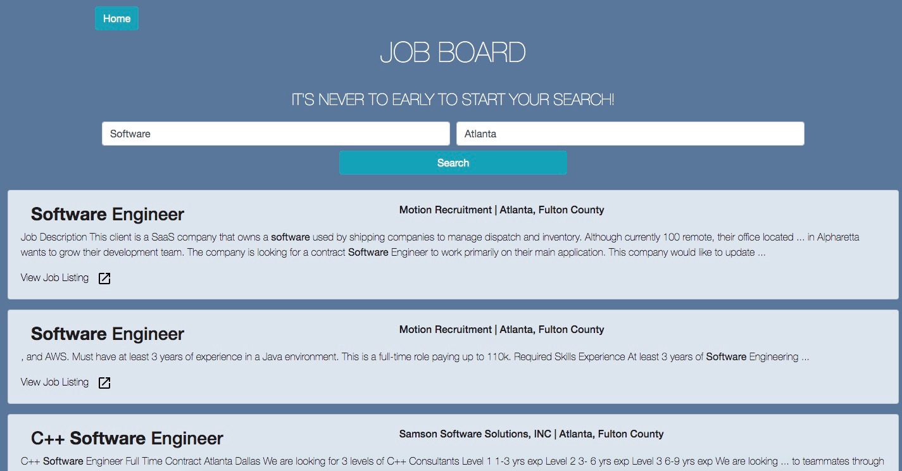

# **BugOut BootCamp Survival Guide**

### VIDEO LINKS ###
* [Promotional](https://youtu.be/jRF_tAQhgkc)
* [Walkthrough](https://youtu.be/BxEIdGMztn8)

## A helpful guide to Navigating Coding BootCamp:

> Learning two years of material in anything is hard enough, and coding is no exception.  It requires a lot of late nights, determination, and organization.  That third thing is where we come in.

### Save code snippets to your Google Drive in JavaScript, Python, SQL, HTML/CSS or Shell right to your Google Drive! ###

Need a code block from class, but don't want to bury it in a huge repository, or dig through slack for it?  Type in the code editor in the language you need (including error linting and syntax highlighting!)

  
*Then save it to your Google Drive, in a folder automatically created for it!*
  

  

### Peronal Assessments to Help you continue to improve! ###

  

### Get a feel for what's out there with our integrated Job Board! ###

### Technologies Used:
**Languages**
* JavaScript
* HTML
* CSS
* JSON
* PostgresQL
* Shell

**Libraries and Frameworks**
* ReactJS
* REDUX
* NODE.js
* Express
* Passport
* SASS
* Material UI
* Bootstrap
* Sequelize
* Google OAuth2
* CodeMirror2
  

DEVELOPED BY THE TEAM IN ROOM 4:
* [Layne Magnuson](https://github.com/laynemag) - UI/UX, Design
* [Ally Deeter](https://github.com/Ardeeter) - Google Drive Integration, API Management
* [Andrea Myers](https://github.com/anjatmyers) - Google OAuth, Design
* [Adam C. MacKinnon](https://github.com/AdamCMacKinnon) - Database, Code Editor Construction
